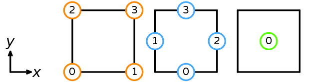

|  | Badges |
| --- | :---: |
| Documentation | [](https://symfem.readthedocs.io/en/latest/?badge=latest) |
| Testing & coverage | [](https://github.com/mscroggs/symfem/actions) [](https://github.com/mscroggs/symfem/actions) [](https://coveralls.io/github/mscroggs/symfem?branch=main) |
| Packages | [](https://pypi.org/project/symfem/) [](https://anaconda.org/conda-forge/symfem) |
| Paper | [](https://doi.org/10.21105/joss.03556) |

Symfem is a symbolic finite element definition library, that can be used to
symbolically evaluate the basis functions of a finite element space. Symfem can:

- Symbolically compute the basis functions of a wide range of finite element spaces
- Symbolically compute derivatives and vector products and substitute values into functions
- Allow the user to define their own element using the Ciarlet definition of a finite element
- Be used to verify that the basis functions of a given space have some desired properties

You can find details of recent changes to Symfem in [the changelog](CHANGELOG.md).

## Installing Symfem
### Installing from source
Symfem can be installed by downloading the [GitHub repo](https://github.com/mscroggs/symfem)
and running:

```bash
python3 setup.py install
```

### Installing using pip
The latest release of Symfem can be installed by running:

```bash
pip3 install symfem
```

### Installing using conda
The latest release of Symfem can be installed by running:

```bash
conda install symfem
```

## Testing Symfem
To run the Symfem unit tests, clone the repository and run:

```bash
python3 -m pytest test/
```

You may instead like to run the following, as this will skip the slowest tests.

```bash
python3 -m pytest test/ --speed fast
```

## Using Symfem
Finite elements can be created in Symfem using the `symfem.create_element()`
function. For example, some elements are created in the following snippet:

```python
import symfem

lagrange = symfem.create_element("triangle", "Lagrange", 1)
rt = symfem.create_element("tetrahedron", "Raviart-Thomas", 2)
nedelec = symfem.create_element("triangle", "N2curl", 1)
qcurl = symfem.create_element("quadrilateral", "Qcurl", 2)
```

The polynomial basis of an element can be obtained by calling `get_polynomial_basis()`:

```python
import symfem

lagrange = symfem.create_element("triangle", "Lagrange", 1)
print(lagrange.get_basis_functions())
```
```
[-x - y + 1, x, y]
```

Each basis function will be a [Sympy](https://www.sympy.org) symbolic expression.

Derivative of these basis functions can be computed using the functions in
[`symfem.calculus`](symfem/calculus.py). Vector-valued basis functions can
be manipulated using the functions in [`symfem.vector`](symfem/vectors.py).

The function `map_to_cell` can be used to map the basis functions of a finite element
to a non-default cell:

```python
import symfem

lagrange = symfem.create_element("triangle", "Lagrange", 1)
print(lagrange.get_basis_functions())
print(lagrange.map_to_cell([(0,0), (2, 0), (2, 1)]))
```
```
[-x - y + 1, x, y]
[1 - x/2, x/2 - y, y]
```

### Further documentation
More detailed documentation of the latest release version of Symfem can be found on
[Read the Docs](https://symfem.readthedocs.io/en/latest/). A series of example uses
of Symfem can be found in the [`demo` folder](demo/) or viewed on
[Read the Docs](https://symfem.readthedocs.io/en/latest/demos/index.html).

Details of the definition of each element can be found on [DefElement](https://defelement.com)
alongside Symfem snippets for creating the element.

## Getting help
You can ask questions about using Symfem by using [GitHub Discussions](https://github.com/mscroggs/symfem/discussions).
Bugs can be reported using the [GitHub issue tracker](https://github.com/mscroggs/symfem/issues).

## Contributing to Symfem
You can find information about how to contribute to Symfem [here](CONTRIBUTING.md).

## Reference cells

### Interval
The reference interval has vertices (0,) and (1,). Its sub-entities are numbered as follows.


### Triangle
The reference triangle has vertices (0, 0), (1, 0), and (0, 1). Its sub-entities are numbered as follows.


### Quadrilateral
The reference quadrilateral has vertices (0, 0), (1, 0), (0, 1), and (1, 1). Its sub-entities are numbered as follows.



### Tetrahedron
The reference tetrahedron has vertices (0, 0, 0), (1, 0, 0), (0, 1, 0), and (0, 0, 1). Its sub-entities are numbered as follows.


### Hexahedron
The reference hexahedron has vertices (0, 0, 0), (1, 0, 0), (0, 1, 0), (1, 1, 0), (0, 0, 1), (1, 0, 1), (0, 1, 1), and (1, 1, 1). Its sub-entities are numbered as follows.


### Prism
The reference prism has vertices (0, 0, 0), (1, 0, 0), (0, 1, 0), (0, 0, 1), (1, 0, 1), and (0, 1, 1). Its sub-entities are numbered as follows.


### Pyramid
The reference pyramid has vertices (0, 0, 0), (1, 0, 0), (0, 1, 0), (1, 1, 0), and (0, 0, 1). Its sub-entities are numbered as follows.


### Dual polygon
The reference dual polygon has vertices (1, 0), (3/4, sqrt(3)/4), (1/2, sqrt(3)/2), (0, sqrt(3)/2), (-1/2, sqrt(3)/2), (-3/4, sqrt(3)/4), (-1, 0), (-3/4, -sqrt(3)/4), (-1/2, -sqrt(3)/2), (0, -sqrt(3)/2), (1/2, -sqrt(3)/2), and (3/4, -sqrt(3)/4). Its sub-entities are numbered as follows.


## List of supported elements
### Interval
- Bernstein
- bubble
- dPc
- Hermite
- Lagrange
- Morley-Wang-Xu
- serendipity
- Taylor
- vector Lagrange
- Wu-Xu

### Triangle
- Argyris
- Arnold-Winther
- Bell
- Bernardi-Raugel
- Bernstein
- Brezzi-Douglas-Fortin-Marini
- Brezzi-Douglas-Marini
- bubble
- bubble enriched Lagrange
- bubble enriched vector Lagrange
- conforming Crouzeix-Raviart
- Crouzeix-Raviart
- Fortin-Soulie
- Guzman-Neilan
- Hellan-Herrmann-Johnson
- Hermite
- Hsieh-Clough-Tocher
- Kong-Mulder-Veldhuizen
- Lagrange
- Mardal-Tai-Winther
- matrix Lagrange
- Morley
- Morley-Wang-Xu
- Nedelec
- Nedelec2
- nonconforming Arnold-Winther
- Raviart-Thomas
- reduced Hsieh-Clough-Tocher
- Regge
- symmetric matrix Lagrange
- Taylor
- transition
- vector Lagrange
- Wu-Xu

### Quadrilateral
- Bogner-Fox-Schmit
- Brezzi-Douglas-Fortin-Marini
- bubble
- direct serendipity
- dPc
- NCE
- NCF
- Q
- serendipity
- serendipity Hcurl
- serendipity Hdiv
- vector dPc
- vector Q

### Tetrahedron
- Bernardi-Raugel
- Bernstein
- Brezzi-Douglas-Fortin-Marini
- Brezzi-Douglas-Marini
- bubble
- Crouzeix-Raviart
- Guzman-Neilan
- Hermite
- Kong-Mulder-Veldhuizen
- Lagrange
- Mardal-Tai-Winther
- matrix Lagrange
- Morley-Wang-Xu
- Nedelec
- Nedelec2
- Raviart-Thomas
- Regge
- symmetric matrix Lagrange
- Taylor
- transition
- vector Lagrange
- Wu-Xu

### Hexahedron
- Brezzi-Douglas-Duran-Fortin
- Brezzi-Douglas-Fortin-Marini
- bubble
- dPc
- NCE
- NCF
- Q
- serendipity
- serendipity Hcurl
- serendipity Hdiv
- vector dPc
- vector Q

### Prism
- Lagrange
- Nedelec

### Pyramid
- Lagrange

### Dual polygon
- Buffa-Christiansen
- dual
- rotated Buffa-Christiansen

