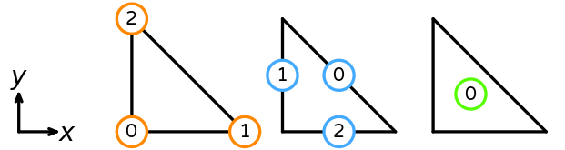
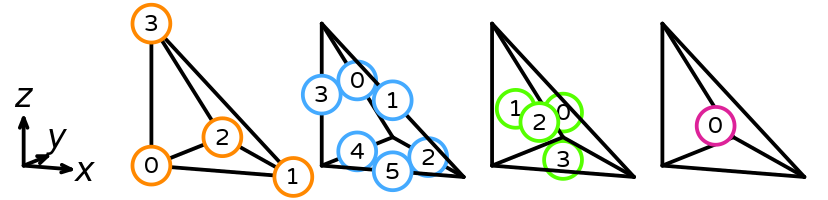
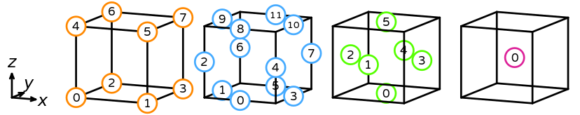
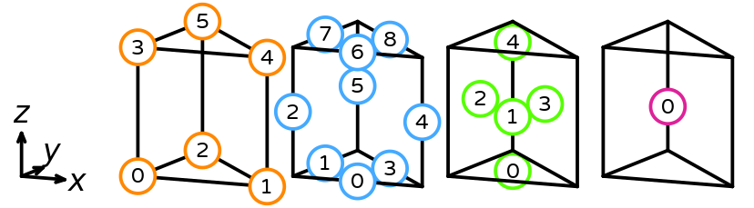
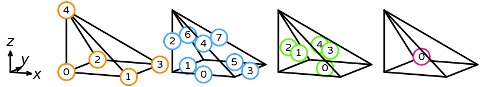
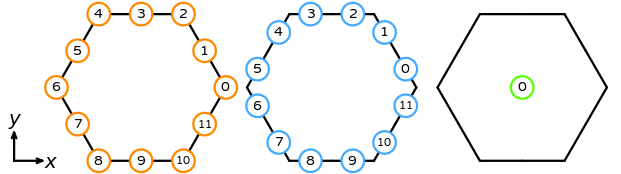

|  | Badges |
| --- | :---: |
| Documentation | [](https://symfem.readthedocs.io/en/latest/?badge=latest) |
| Testing&nbsp;&&nbsp;coverage | [](https://github.com/mscroggs/symfem/actions) [](https://github.com/mscroggs/symfem/actions) [](https://coveralls.io/github/mscroggs/symfem?branch=main)  [](https://defelement.com/verification.html) |
| Packages | [](https://pypi.org/project/symfem/) [](https://anaconda.org/conda-forge/symfem) |
| Paper | [](https://doi.org/10.21105/joss.03556) |
| Code&nbsp;quality | [](https://sonarcloud.io/summary/overall?id=mscroggs_symfem) |

Symfem is a symbolic finite element definition library, that can be used to
symbolically evaluate the basis functions of a finite element space. Symfem can:

- Symbolically compute the basis functions of a wide range of finite element spaces
- Symbolically compute derivatives and vector products and substitute values into functions
- Allow the user to define their own element using the Ciarlet definition of a finite element
- Be used to verify that the basis functions of a given space have some desired properties

You can find details of recent changes to Symfem in [the changelog](CHANGELOG.md).

# Installing Symfem
## Installing from source
Symfem can be installed by downloading the [GitHub repo](https://github.com/mscroggs/symfem)
and running:

```bash
python3 setup.py install
```

## Installing using pip
The latest release of Symfem can be installed by running:

```bash
pip3 install symfem
```

## Installing using conda
The latest release of Symfem can be installed by running:

```bash
conda install -c conda-forge symfem
```

# Testing Symfem
To run the Symfem unit tests, clone the repository and run:

```bash
python3 -m pytest test/
```

You may instead like to run the following, as this will skip the slowest tests.

```bash
python3 -m pytest test/ --speed fast
```

# Using Symfem
Finite elements can be created in Symfem using the `symfem.create_element()`
function. For example, some elements are created in the following snippet:

```python
import symfem

lagrange = symfem.create_element("triangle", "Lagrange", 1)
rt = symfem.create_element("tetrahedron", "Raviart-Thomas", 2)
nedelec = symfem.create_element("triangle", "N2curl", 1)
qcurl = symfem.create_element("quadrilateral", "Qcurl", 2)
```

The polynomial basis of an element can be obtained by calling `get_polynomial_basis()`:

```python

lagrange = symfem.create_element("triangle", "Lagrange", 1)
print(lagrange.get_basis_functions())
```
```
[-x - y + 1, x, y]
```

Each basis function will be a [Sympy](https://www.sympy.org) symbolic expression.

Derivative of these basis functions can be computed using the functions in
[`symfem.calculus`](symfem/calculus.py). Vector-valued basis functions can
be manipulated using the functions in [`symfem.vector`](symfem/vectors.py).

The function `map_to_cell` can be used to map the basis functions of a finite element
to a non-default cell:

```python

lagrange = symfem.create_element("triangle", "Lagrange", 1)
print(lagrange.get_basis_functions())
print(lagrange.map_to_cell([(0,0), (2, 0), (2, 1)]))
```
```
[-x - y + 1, x, y]
[1 - x/2, x/2 - y, y]
```

## Further documentation
More detailed documentation of the latest release version of Symfem can be found on
[Read the Docs](https://symfem.readthedocs.io/en/latest/). A series of example uses
of Symfem can be found in the [`demo` folder](demo/) or viewed on
[Read the Docs](https://symfem.readthedocs.io/en/latest/demos/index.html).

Details of the definition of each element can be found on [DefElement](https://defelement.com)
alongside Symfem snippets for creating the element.

## Getting help
You can ask questions about using Symfem by using [GitHub Discussions](https://github.com/mscroggs/symfem/discussions).
Bugs can be reported using the [GitHub issue tracker](https://github.com/mscroggs/symfem/issues).

# Contributing to Symfem
## Reporting bugs
If you find a bug in Symfem, please report it on the [issue tracker](https://github.com/mscroggs/symfem/issues/new?assignees=&labels=bug&template=bug_report.md&title=).

## Suggesting enhancements
If you want to suggest a new feature or an improvement of a current feature, you can submit this
on the [issue tracker](https://github.com/mscroggs/symfem/issues/new?assignees=&labels=enhancement&template=feature_request.md&title=).

## Adding a new element
If you want to add a new element to Symfem, take a look at the [Adding an element guide](ADDING_AN_ELEMENT.md).

## Submitting a pull request
If you want to directly submit code to Symfem, you can do this by forking the Symfem repo, then submitting a pull request.
If you want to contribute, but are unsure where to start, have a look at the
[issues labelled "good first issue"](https://github.com/mscroggs/symfem/issues?q=is%3Aopen+is%3Aissue+label%3A%22good+first+issue%22).

On opening a pull request, unit tests and flake8 style checks will run. You can click on these in the pull request
to see where (if anywhere) there are errors in your code.

## Code of conduct
We expect all our contributors to follow [the Contributor Covenant](CODE_OF_CONDUCT.md). Any unacceptable
behaviour can be reported to Matthew (symfem@mscroggs.co.uk).

# Available cells and elements
## Interval
The reference interval has vertices (0,) and (1,). Its sub-entities are numbered as follows.


### List of supported elements
- Bernstein (alternative names: Bernstein-Bezier)
- bubble
- dPc
- enriched Galerkin (alternative names: EG)
- Hermite
- Lagrange (alternative names: P)
- Morley-Wang-Xu (alternative names: MWX)
- P1-iso-P2 (alternative names: P2-iso-P1, iso-P2 P1)
- serendipity (alternative names: S)
- Taylor (alternative names: discontinuous Taylor)
- vector Lagrange (alternative names: vP)
- Wu-Xu

## Triangle
The reference triangle has vertices (0, 0), (1, 0), and (0, 1). Its sub-entities are numbered as follows.



### List of supported elements
- Alfeld-Sorokina (alternative names: AS)
- Argyris
- Arnold-Winther (alternative names: AW, conforming Arnold-Winther)
- Bell
- Bernardi-Raugel
- Bernstein (alternative names: Bernstein-Bezier)
- Brezzi-Douglas-Fortin-Marini (alternative names: BDFM)
- Brezzi-Douglas-Marini (alternative names: BDM, N2div)
- bubble
- bubble enriched Lagrange
- bubble enriched vector Lagrange
- conforming Crouzeix-Raviart (alternative names: conforming CR)
- Crouzeix-Raviart (alternative names: CR, Crouzeix-Falk, CF)
- enriched Galerkin (alternative names: EG)
- enriched vector Galerkin (alternative names: locking-free enriched Galerkin, LFEG)
- Fortin-Soulie (alternative names: FS)
- Guzman-Neilan
- Hellan-Herrmann-Johnson (alternative names: HHJ)
- Hermite
- Hsieh-Clough-Tocher (alternative names: Clough-Tocher, HCT, CT)
- Kong-Mulder-Veldhuizen (alternative names: KMV)
- Lagrange (alternative names: P)
- Mardal-Tai-Winther (alternative names: MTW)
- matrix Lagrange
- Morley
- Morley-Wang-Xu (alternative names: MWX)
- Nedelec (alternative names: Nedelec1, N1curl)
- Nedelec2 (alternative names: N2curl)
- nonconforming Arnold-Winther (alternative names: nonconforming AW)
- P1 macro
- P1-iso-P2 (alternative names: P2-iso-P1, iso-P2 P1)
- Raviart-Thomas (alternative names: RT, N1div)
- reduced Hsieh-Clough-Tocher (alternative names: rHCT)
- Regge
- symmetric matrix Lagrange
- Taylor (alternative names: discontinuous Taylor)
- transition
- vector Lagrange (alternative names: vP)
- Wu-Xu

## Quadrilateral
The reference quadrilateral has vertices (0, 0), (1, 0), (0, 1), and (1, 1). Its sub-entities are numbered as follows.


### List of supported elements
- Arbogast-Correa (alternative names: AC, AC full, Arbogast-Correa full)
- Arnold-Boffi-Falk (alternative names: ABF)
- Bogner-Fox-Schmit (alternative names: BFS)
- Brezzi-Douglas-Fortin-Marini (alternative names: BDFM)
- bubble
- direct serendipity
- dPc
- enriched Galerkin (alternative names: EG)
- enriched vector Galerkin (alternative names: locking-free enriched Galerkin, LFEG)
- Huang-Zhang (alternative names: HZ)
- NCE (alternative names: RTCE, Qcurl, Nedelec, Ncurl)
- NCF (alternative names: RTCF, Qdiv)
- P1-iso-P2 (alternative names: P2-iso-P1, iso-P2 P1)
- Q (alternative names: Lagrange, P)
- Rannacher-Turek
- Regge
- serendipity (alternative names: S)
- serendipity Hcurl (alternative names: Scurl, BDMCE, AAE)
- serendipity Hdiv (alternative names: Sdiv, BDMCF, AAF)
- tiniest tensor (alternative names: TNT)
- tiniest tensor Hcurl (alternative names: TNTcurl)
- tiniest tensor Hdiv (alternative names: TNTdiv)
- trimmed serendipity Hcurl (alternative names: TScurl)
- trimmed serendipity Hdiv (alternative names: TSdiv)
- vector dPc
- vector Q (alternative names: vQ)

## Tetrahedron
The reference tetrahedron has vertices (0, 0, 0), (1, 0, 0), (0, 1, 0), and (0, 0, 1). Its sub-entities are numbered as follows.



### List of supported elements
- Bernardi-Raugel
- Bernstein (alternative names: Bernstein-Bezier)
- Brezzi-Douglas-Fortin-Marini (alternative names: BDFM)
- Brezzi-Douglas-Marini (alternative names: BDM, N2div)
- bubble
- Crouzeix-Raviart (alternative names: CR, Crouzeix-Falk, CF)
- enriched Galerkin (alternative names: EG)
- enriched vector Galerkin (alternative names: locking-free enriched Galerkin, LFEG)
- Guzman-Neilan
- Hellan-Herrmann-Johnson (alternative names: HHJ)
- Hermite
- Kong-Mulder-Veldhuizen (alternative names: KMV)
- Lagrange (alternative names: P)
- Mardal-Tai-Winther (alternative names: MTW)
- matrix Lagrange
- Morley-Wang-Xu (alternative names: MWX)
- Nedelec (alternative names: Nedelec1, N1curl)
- Nedelec2 (alternative names: N2curl)
- Raviart-Thomas (alternative names: RT, N1div)
- Regge
- symmetric matrix Lagrange
- Taylor (alternative names: discontinuous Taylor)
- transition
- vector Lagrange (alternative names: vP)
- Wu-Xu

## Hexahedron
The reference hexahedron has vertices (0, 0, 0), (1, 0, 0), (0, 1, 0), (1, 1, 0), (0, 0, 1), (1, 0, 1), (0, 1, 1), and (1, 1, 1). Its sub-entities are numbered as follows.



### List of supported elements
- Brezzi-Douglas-Duran-Fortin (alternative names: BDDF)
- Brezzi-Douglas-Fortin-Marini (alternative names: BDFM)
- bubble
- dPc
- enriched Galerkin (alternative names: EG)
- enriched vector Galerkin (alternative names: locking-free enriched Galerkin, LFEG)
- NCE (alternative names: RTCE, Qcurl, Nedelec, Ncurl)
- NCF (alternative names: RTCF, Qdiv)
- Q (alternative names: Lagrange, P)
- Rannacher-Turek
- Regge
- serendipity (alternative names: S)
- serendipity Hcurl (alternative names: Scurl, BDMCE, AAE)
- serendipity Hdiv (alternative names: Sdiv, BDMCF, AAF)
- tiniest tensor (alternative names: TNT)
- tiniest tensor Hcurl (alternative names: TNTcurl)
- tiniest tensor Hdiv (alternative names: TNTdiv)
- trimmed serendipity Hcurl (alternative names: TScurl)
- trimmed serendipity Hdiv (alternative names: TSdiv)
- vector dPc
- vector Q (alternative names: vQ)

## Prism
The reference prism has vertices (0, 0, 0), (1, 0, 0), (0, 1, 0), (0, 0, 1), (1, 0, 1), and (0, 1, 1). Its sub-entities are numbered as follows.



### List of supported elements
- Lagrange (alternative names: P)
- Nedelec (alternative names: Ncurl)

## Pyramid
The reference pyramid has vertices (0, 0, 0), (1, 0, 0), (0, 1, 0), (1, 1, 0), and (0, 0, 1). Its sub-entities are numbered as follows.



### List of supported elements
- Lagrange (alternative names: P)

## Dual polygon
The reference dual polygon (hexagon example shown) has vertices (1, 0), (3/4, sqrt(3)/4), (1/2, sqrt(3)/2), (0, sqrt(3)/2), (-1/2, sqrt(3)/2), (-3/4, sqrt(3)/4), (-1, 0), (-3/4, -sqrt(3)/4), (-1/2, -sqrt(3)/2), (0, -sqrt(3)/2), (1/2, -sqrt(3)/2), and (3/4, -sqrt(3)/4). Its sub-entities are numbered as follows.



### List of supported elements
- Buffa-Christiansen (alternative names: BC)
- dual polynomial (alternative names: dual P, dual)
- rotated Buffa-Christiansen (alternative names: RBC)

